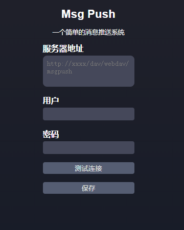
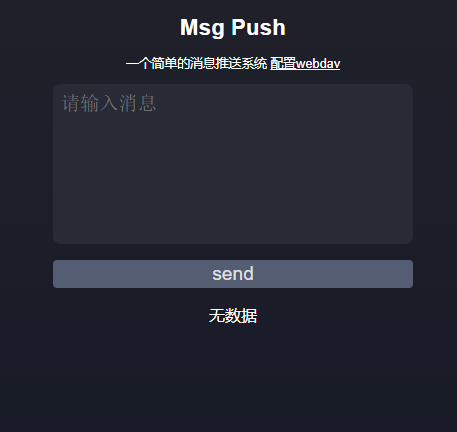
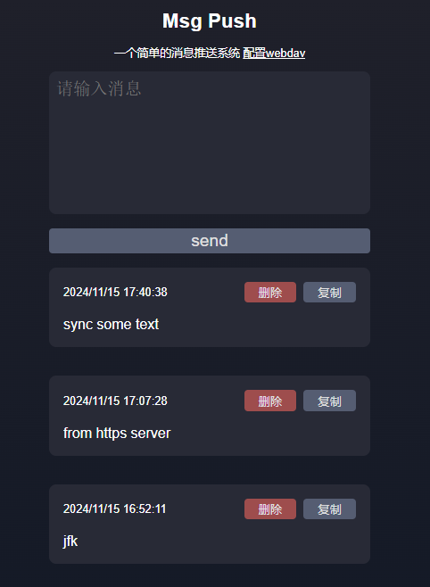

# Message Sync

## Introduction

This project is a simple message sync app that allows users to send messages to a webdav server and receive messages from it.

It is useful for sending messages cross-platform, without the need for an email account or a third-party app.

This project is built with Vanilla JavaScript, HTML, and CSS, build by using the Rsbuild.js framework.

## UI

config page:



home page:



home page with messages:



## Setup

Install the dependencies:

```bash
pnpm install
```

## Get Started

Start the dev server:

```bash
pnpm dev
```

Build the app for production:

```bash
pnpm build
```

Preview the production build locally:

```bash
pnpm preview
```

## License

This project is licensed under the MIT License - see the [LICENSE](LICENSE) file for details.